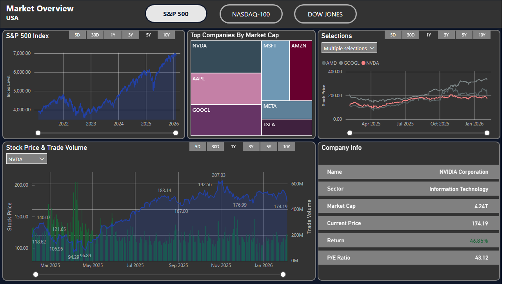

# 📊 Stock Market Dashboard

Interactive stock market dashboard built in Power BI. Tracks stock performance up to 10 years, for companies in S&P 500, NASDAQ-100, and Dow Jones Industrial Average indexes. 

---

## 📸 Dashboard Preview

---

## 🔍 Overview

This project automates the extraction, transformation, and visualization of historical stock market data for major U.S. equity indexes. A Python-based data pipeline feeds a Power BI data model designed for interactive analysis and long-term trend exploration. Stock market data is extracted from Yahoo Finance and Wikipedia. 

The resulting dashboard supports index comparisons, company-level analysis, and flexible time-range slicing. This project was built as a portfolio piece to demonstrate analytics engineering, automation, and BI development skills.

---

## 🚀 Features

- Automated extraction of historical stock price data (daily granularity, up to 10 years)
- Coverage of major U.S. market indexes:
  - S&P 500  
  - NASDAQ-100  
  - Dow Jones Industrial Average
- Python-based data pipeline for repeatable data refreshes
- Data cleaning, normalization, and enrichment using pandas
- Power BI data model optimized for time-series analysis
- Interactive slicers for:
  - Index selection  
  - Company selection  
  - Custom time ranges (5D, 30D, 1Y, 5Y, 10Y)
- KPI cards for quick performance insights (returns, trends, comparisons)
- Designed for portfolio demonstration and analytics engineering practice

---

## 🛠️ Tech Stack

**Language**
- Python  

**Python Libraries**
- pandas — data cleaning, transformation, and aggregation  
- yfinance — historical stock price extraction  
- requests — HTTP requests and web data retrieval  
- tqdm — progress tracking for long-running data pulls  
- collections (defaultdict) — structured in-memory data organization  
- datetime — date handling and time-series alignment  
- time (sleep) — request throttling and rate control  
- io (StringIO) — in-memory text and data parsing  

**Business Intelligence**
- Power BI — data modeling, DAX measures, and interactive dashboards  
- Power Query — data shaping and preprocessing  

**Development & Tooling**
- Git & GitHub — version control and project documentation  
- Visual Studio Code — development environment  

---

## ▶️ User Instructions

### 1️⃣ Clone the repository
git clone https://github.com/your-username/your-repo-name.git
cd your-repo-name

### 2️⃣ Install Python dependencies
pip install pandas requests yfinance tqdm

### 3️⃣ Run the data extraction scripts
'Data Extraction Script SP500.py'
'Data Extraction Script NASDAQ100.py'
'Data Extraction Script DOW30.py'

### 4️⃣ Open the Power BI dashboard
Open 'Market Overview Dashboard.pbix' in Power BI Desktop, update the data source paths to point to the locally generated CSV files when prompted, and refresh the dataset to load the latest data.

### 5️⃣ Explore the dashboard
Use slicers and filters to switch between market indexes, select individual companies, adjust historical time ranges (up to 10 years), and compare performance across indexes.